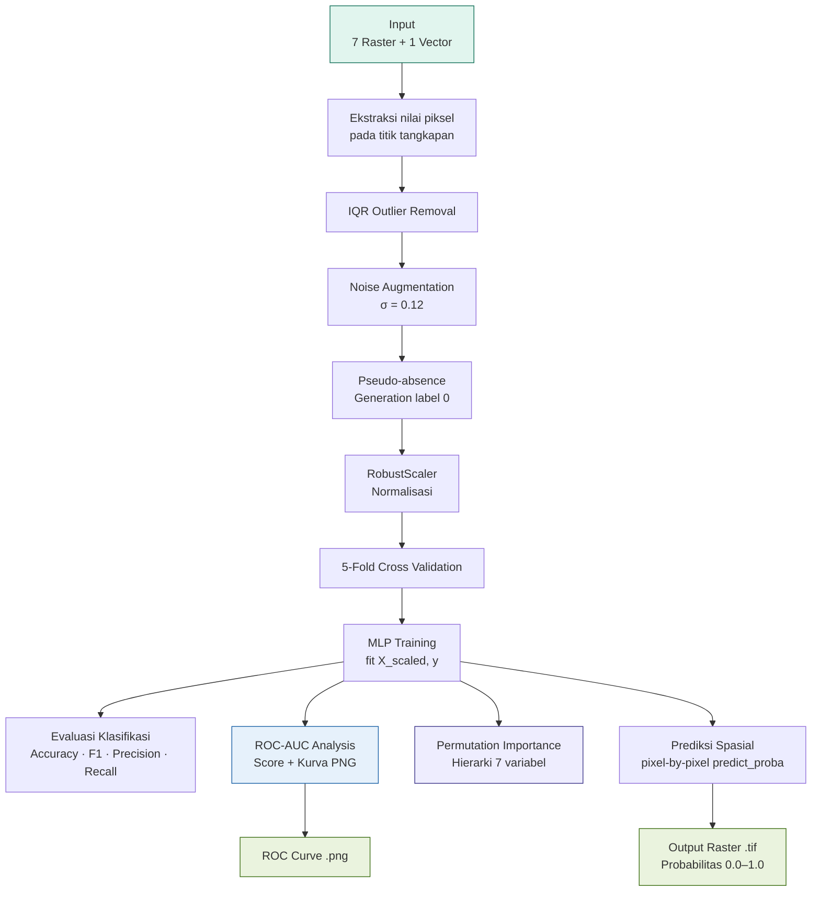

# 🧠 Alur Logika Kode — MLP Activation Comparison Toolbox

> Dokumentasi alur logika pemrograman untuk tiga skrip QGIS Custom Processing Toolbox:
> `mlp_tanh.py` · `mlp_relu.py` · `mlp_sigmoid.py`

---

## 📐 Arsitektur Umum

Ketiga skrip memiliki **alur logika yang identik** — satu-satunya perbedaan adalah nilai parameter `activation` pada `MLPClassifier`. Setiap skrip terdiri dari **8 tahap utama**:

```
INPUT (raster + vector)
    │
    ▼
[1] INISIALISASI
    │
    ▼
[2] EKSTRAKSI DATA
    │
    ▼
[3] PRE-PROCESSING ── IQR → Augmentasi → Pseudo-absence → Normalisasi
    │
    ▼
[4] TRAINING MLP ── 5-Fold CV → fit()
    │
    ▼
[5] EVALUASI KLASIFIKASI ── Accuracy · Precision · Recall · F1
    │
    ▼
[6] ROC-AUC ANALYSIS ── AUC score → interpretasi → export PNG
    │
    ▼
[7] PERMUTATION IMPORTANCE ── XAI · hierarki prediktor
    │
    ▼
[8] PREDIKSI SPASIAL ── pixel-by-pixel → output raster .tif
    │
    ▼
OUTPUT (raster probabilitas + ROC curve PNG)
```

---

## 🔢 Detail Setiap Tahap

### `[1]` Inisialisasi

```
SET  random_seed = 42              → menjamin hasil reprodusibel
LOG  header ke Processing Log      → nama aktivasi, arsitektur, author
LOAD 7 raster layer                → SST, CHL-a, Bathy, Coral, Sal, SSE, Current
LOAD 1 vector layer                → titik koordinat tangkapan ikan
SET  output_path                   → lokasi penyimpanan raster hasil prediksi
```

---

### `[2]` Ekstraksi Data

```
FOR setiap titik di vector layer:
    GET koordinat (x, y)
    FOR setiap raster (7 variabel):
        SAMPLE nilai piksel pada koordinat (x, y)
        IF nilai == NaN atau -9999:
            SKIP titik ini (tidak valid)
            BREAK
    IF semua nilai valid:
        APPEND [sst, chl, bathy, coral, sal, sse, current] ke raw_presence

OUTPUT → raw_presence : list of lists shape (n_points, 7)
```

---

### `[3]` Pre-processing

Pre-processing terdiri dari **4 sub-tahap berurutan**:

#### `3a` IQR Outlier Removal

```
HITUNG Q1, Q3 per kolom (per variabel)
HITUNG IQR = Q3 - Q1
HAPUS baris di mana nilai < (Q1 - 1.5×IQR)
                   atau > (Q3 + 1.5×IQR)

Tujuan  → menghilangkan noise sensor satelit dan anomali ekstrem
Output  → df_clean (DataFrame bersih)
```

#### `3b` Noise Augmentation

```
FOR i in range(len(df_clean)):
    PILIH satu titik presence secara acak
    BUAT noise = Normal(mean=0, std=0.12) × nilai asli  [multiplicative]
    APPEND titik baru = titik_asli + noise ke pres_vals

Hasil   → pres_vals = 2× jumlah presence awal
Tujuan  → mencegah overfitting, memaksa model belajar pola umum
          bukan menghafal koordinat spesifik
```

#### `3c` Pseudo-absence Generation

```
FOR i in range(len(pres_vals)):
    FOR setiap variabel j:
        arah = +1 atau -1  (random 50:50)
        nilai = mean_j + (std_j × 1.0 × arah)
    APPEND ke abs_vals

Label abs_vals = 0  (absence)
Label pres_vals = 1  (presence)

Tujuan  → membuat kelas negatif yang secara statistik berbeda
          tapi masih dalam cakupan ekologi WPP 573
```

#### `3d` Gabung, Shuffle & Normalisasi

```
X = vstack([pres_vals, abs_vals])   → shape (n_total, 7)
y = hstack([ones, zeros])           → shape (n_total,)

SHUFFLE X dan y dengan seed=42      → mencegah bias urutan

NORMALISASI dengan RobustScaler:
    scale = (X - median) / IQR      → tahan terhadap outlier sisa
    Output → X_scaled
```

---

### `[4]` Training MLP

```
KONFIGURASI MLPClassifier:
    hidden_layer_sizes = (3,)          → 1 hidden layer, 3 neuron
    activation         = ***           → 'tanh' | 'relu' | 'logistic'
    solver             = 'lbfgs'       → Limited-memory BFGS optimizer
    alpha              = 5.0           → L2 regularisasi kuat (anti-overfitting)
    max_iter           = 1500          → batas iterasi konvergensi
    random_state       = 42            → reprodusibilitas

5-FOLD CROSS VALIDATION:
    BAGI X_scaled, y menjadi 5 subset
    FOR setiap fold:
        TRAIN pada 4 subset
        EVALUATE pada 1 subset
    CATAT mean accuracy dan std → log

TRAINING FINAL:
    mlp.fit(X_scaled, y)               → latih dengan seluruh data

PREDIKSI:
    y_pred = mlp.predict(X_scaled)          → label kelas (0 atau 1)
    y_prob = mlp.predict_proba(X_scaled)[:,1] → probabilitas kelas 1
```

---

### `[5]` Evaluasi Klasifikasi

```
HITUNG accuracy_score(y, y_pred)
    → proporsi prediksi benar dari total prediksi

HITUNG f1_score(y, y_pred, average='weighted')
    → harmonik rata-rata precision dan recall

HITUNG classification_report(y, y_pred):
    → per kelas (0 = absence, 1 = presence):
        precision = TP / (TP + FP)
        recall    = TP / (TP + FN)
        f1-score  = 2 × (precision × recall) / (precision + recall)
        support   = jumlah sampel per kelas

LOG semua metrik ke Processing Log
```

---

### `[6]` ROC-AUC Analysis *(tambahan)*

Ini adalah tahap **tambahan** yang tidak ada di skrip original. ROC-AUC mengukur kemampuan diskriminasi model di **semua threshold sekaligus** — lebih robust dari accuracy tunggal, terutama untuk dataset dengan pseudo-absence sintetis.

```
HITUNG roc_auc_score(y, y_prob)
    → satu angka AUC antara 0.0 dan 1.0
    → semakin dekat 1.0 = semakin baik

INTERPRETASI otomatis:
    IF AUC >= 0.90  → "Excellent (>= 0.90)"
    IF AUC >= 0.80  → "Good (0.80 - 0.89)"
    IF AUC >= 0.70  → "Fair (0.70 - 0.79)"
    ELSE            → "Poor (< 0.70)"

HITUNG roc_curve(y, y_prob)
    → fpr (False Positive Rate) per threshold
    → tpr (True Positive Rate) per threshold

PLOT kurva ROC dengan matplotlib:
    LINE biru      = kurva model (fpr vs tpr)
    LINE abu putus = random classifier (diagonal 0,0 → 1,1)
    FILL biru transparan = area under curve

SIMPAN sebagai PNG:
    path  = folder_output / roc_curve_{activation}.png
    dpi   = 150
    format → bbox_inches='tight'

LOG AUC score + interpretasi + path PNG ke Processing Log
```

---

### `[7]` Permutation Importance (XAI)

```
PANGGIL permutation_importance(mlp, X_scaled, y, n_repeats=10):
    FOR setiap fitur j (dari 7 variabel):
        FOR 10 kali pengulangan:
            ACAK nilai kolom j di X_scaled
            UKUR penurunan akurasi dibanding baseline
        HITUNG mean dan std penurunan akurasi

URUTKAN fitur dari importance tertinggi ke terendah
    (argsort descending)

LOG per variabel:
    "{nama_variabel} : {mean:.4f} (+/- {std:.4f})"

Interpretasi:
    Nilai tinggi → variabel sangat penting (akurasi turun banyak jika diacak)
    Nilai = 0.0  → variabel tidak berkontribusi pada model ini
```

---

### `[8]` Prediksi Spasial

```
SET base_raster = raster SST  (referensi dimensi dan extent)
GET rows = base.height()
GET cols = base.width()

INISIALISASI output raster:
    format    = Float32
    nodata    = -9999.0
    dimensi   = cols × rows
    extent    = sama dengan base raster
    CRS       = sama dengan base raster

LOAD semua raster sebagai block:
    blocks[k] = raster[k].block(extent, cols, rows)
    → baca seluruh piksel sekaligus ke memori (lebih efisien)

FOR r in range(rows):
    IF feedback.isCanceled(): BREAK     → respons tombol Cancel QGIS

    FOR c in range(cols):
        AMBIL nilai 7 variabel pada piksel (r, c)
        IF ada nilai NaN atau -9999:
            TULIS -9999 ke output (NoData)
            CONTINUE

        NORMALISASI: scaler.transform([[v1,v2,...,v7]])
        PREDIKSI:   prob = mlp.predict_proba(...)][0][1]
                         → ambil probabilitas kelas 1 (presence)
        TULIS prob ke out_block[r, c]

    UPDATE progress bar → int((r/rows) × 100) %

TULIS out_block ke output raster provider
RETURN path output raster
```

---

## ⚖️ Perbedaan Ketiga File

| Parameter | `mlp_tanh.py` | `mlp_relu.py` | `mlp_sigmoid.py` |
|---|:---:|:---:|:---:|
| `activation` | `'tanh'` | `'relu'` | `'logistic'` |
| Class name | `PrediksiIkanMLPTargetFinal` | `PrediksiIkanMLPReLU` | `PrediksiIkanMLPSigmoid` |
| `name()` | `mlp_anti_overfitting` | `mlp_relu` | `mlp_sigmoid` |
| Output label | Hasil Prediksi MLP (Anti-Overfitting) | Hasil Prediksi MLP ReLU | Hasil Prediksi MLP Sigmoid |
| ROC file | `roc_curve_tanh.png` | `roc_curve_relu.png` | `roc_curve_logistic.png` |

> **Catatan:** `'logistic'` adalah nama scikit-learn untuk fungsi sigmoid — identik secara matematis.

---

## 📋 Format Output Processing Log

Berikut contoh format lengkap yang ditampilkan di QGIS Processing Log:

```
==================================================
  MODEL: MLP | AKTIVASI: tanh
  Alpha: 5.0 | 1 Hidden Layer, 3 Neuron, L-BFGS
  Author: Rosyid Paundra Gamawan — UGM 2025
==================================================

CV Accuracy (5-Fold) mean : 0.8395
CV Accuracy (5-Fold) std  : 0.02xx

======== EVALUASI MODEL — AKTIVASI tanh ========
Accuracy           : 0.8557
F1-Score (weighted): 0.8500

              precision  recall  f1-score  support
         0.0     0.79     0.96     0.87      246    ← kelas absence
         1.0     0.95     0.75     0.84      246    ← kelas presence

    accuracy                         0.86      492
   macro avg     0.87     0.86     0.85      492
weighted avg     0.87     0.86     0.85      492

======== ROC-AUC ANALYSIS ========
ROC-AUC Score      : 0.8343
Interpretasi AUC   : Good (0.80 - 0.89)
Kurva ROC disimpan : C:/.../roc_curve_tanh.png

======== PERMUTATION IMPORTANCE ========
  SST                 : 0.1386 (+/- 0.0214)
  Salinitas           : 0.0976 (+/- 0.0156)
  Current Velocity    : 0.0866 (+/- 0.0049)
  Batimetri           : 0.0762 (+/- 0.0060)
  Chlorophyll-a       : 0.0681 (+/- 0.0046)
  SSE                 : 0.0400 (+/- 0.0123)
  Coral Reef          : 0.0000 (+/- 0.0000)
```

---

## 📦 Format File Output

| File | Format | Tipe Data | Nilai | Keterangan |
|---|---|:---:|---|---|
| Raster prediksi | `.tif` | Float32 | `0.0 – 1.0` | Probabilitas habitat per piksel |
| Raster prediksi | `.tif` | Float32 | `-9999` | NoData (piksel tidak valid) |
| Kurva ROC | `.png` | RGB | — | 150 DPI, disimpan di folder output |

### Interpretasi nilai raster

```
0.0 – 0.3   →  Habitat tidak sesuai        (warna dingin — biru/hijau)
0.3 – 0.6   →  Habitat potensial sedang    (warna transisi — kuning)
0.6 – 1.0   →  Habitat sangat sesuai       (warna hangat — oranye/merah)
             →  Zona tangkapan prioritas
```

> **Tips QGIS:** Gunakan color ramp **RdYlBu (reversed)** atau **Magma** pada layer raster
> untuk visualisasi probabilitas habitat yang intuitif.

---

## 🔄 Diagram Alir Ringkas (Mermaid)



---

*Dokumentasi ini merupakan bagian dari repositori:*
**MLP Activation Comparison Toolbox for Pelagic Fish Habitat Mapping — FMA 573**
*Rosyid Paundra Gamawan · Remote Sensing Program · UGM · 2025*
